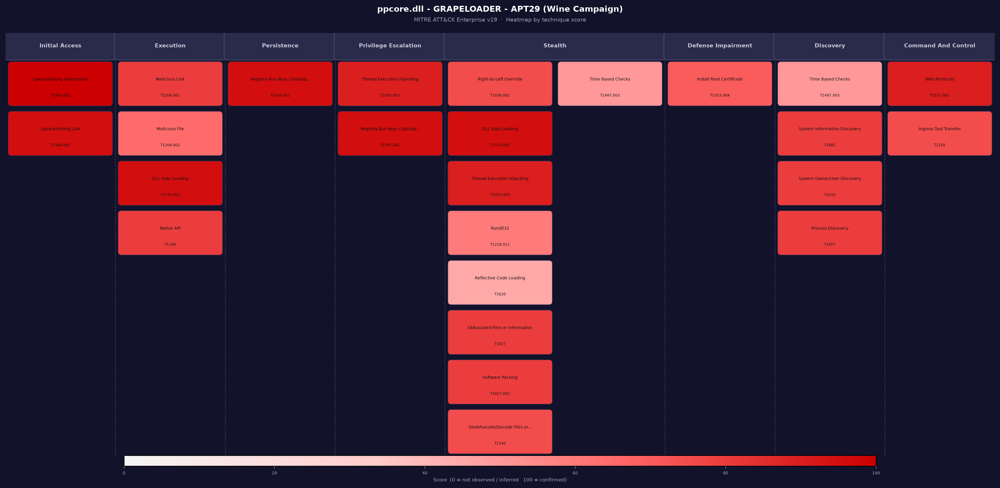

# attackmap

A Python script that generates MITRE ATT&CK heatmaps from ATT&CK Navigator JSON layers.
Technique names and tactic assignments are resolved dynamically from the official STIX bundle.
 
Supported output formats: **PNG**, **SVG**, **PDF**

---
 
## Features
 
- Reads any ATT&CK Navigator layer (Enterprise, v4.5+)
- Resolves technique names and tactic assignments from the STIX bundle at runtime
- Auto-splits dense tactic columns into sub-columns
- Score-based color gradient representing analyst confidence / evidence strength for each technique (0–100)
- PNG / SVG / PDF output

---

## Installation
 
**1. Install Python dependencies**
 
```bash
pip install matplotlib mitreattack-python
```
 
**2. Download the Enterprise ATT&CK STIX bundle**
 
```bash
curl -L -o enterprise-attack.json \
  https://raw.githubusercontent.com/mitre/cti/master/enterprise-attack/enterprise-attack.json
```

---

## Usage
 
```bash
python attackmap.py \
  --layer  <layer.json> \
  --stix   <enterprise-attack.json> \
  --output <output/heatmap> \
  --title  "<Heatmap title>" \
  --format <png|svg|pdf|all> \
  --min-score <0-100>
```
 
| Argument      | Required | Default    | Description                                        |
|---------------|----------|------------|----------------------------------------------------|
| `--layer`     | yes      | —          | ATT&CK Navigator JSON layer file                   |
| `--stix`      | yes      | —          | Enterprise ATT&CK STIX bundle (JSON)               |
| `--output`    | yes      | —          | Output file path (extension overridden by `--format`) |
| `--title`     | no       | Layer name | Title displayed on the heatmap                     |
| `--format`    | no       | `png`      | Output format: `png`, `svg`, `pdf`, or `all`       |
| `--min-score` | no       | `0`      | Minimum score threshold (0–100)                    |

 
> Using `--format all` generates PNG, SVG, and PDF in a single run.

### Filtering by score

Use `--min-score` to display only techniques above a confidence threshold:

```bash
python attackmap.py \
  --layer example-layer.json \
  --stix enterprise-attack.json \
  --output heatmap \
  --min-score 80
```

This renders only techniques with a score ≥ 80, useful for isolating confirmed detections from inferred ones.
 
---

## Layer format
 
The only required fields per technique are `techniqueID` and `score` (0–100).
 
The `score` represents analyst-defined confidence in the presence of the technique in the analyzed sample.
 
```json
{
  "name": "My layer",
  "versions": { "attack": "19", "navigator": "5.1.0", "layer": "4.5" },
  "domain": "enterprise-attack",
  "techniques": [
    { "techniqueID": "T1566.001", "score": 100 },
    { "techniqueID": "T1055.003", "score": 90 }
  ]
}
```
 
> Scores are user-defined and may vary depending on analytical methodology.

---
 
## Output example (PNG)
 


---


## Project structure

````
attackmap/
├── docs/
│   ├── example_heatmap.pdf
│   ├── example_heatmap.svg
│   └── example_heatmap.png
├── examples/
│   └── example-layer.json
├── .gitignore
├── attackmap.py
├── LICENSE
├── README.md
└── ROADMAP.md
````

## License

This project is licensed under the MIT License — see the [LICENSE](LICENSE) file for details.